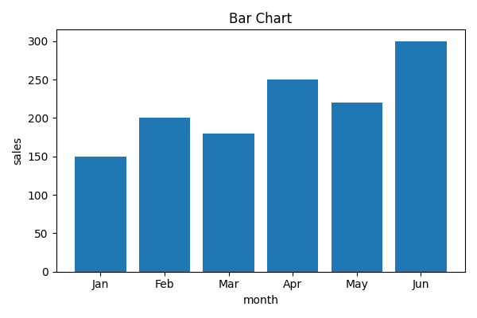
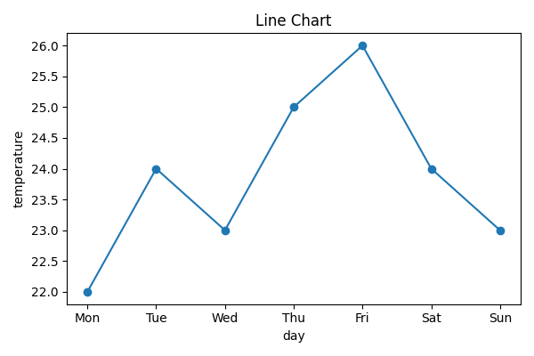
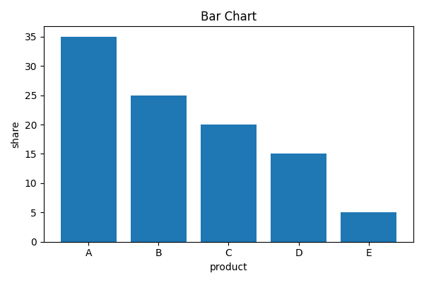

# Complex Charts Example

## Sales Data

Monthly sales data with multiple categories:

## Temperature Data

Daily temperature readings:

## Product Distribution

Market share by product:

End of example.